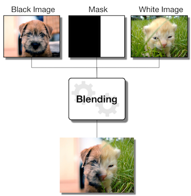

# Pyramid Blending

**Important Note:** This assignment is subject to the "Above & Beyond" rule. In summary: meeting all stated requirements will earn 90%; the last 10% is reserved for individual effort to research, implement, and report some additional high-quality work on this topic beyond the minimum requirements. Your A&B work must be accompanied by discussion of the computational photographic concepts involved, and will be graded based on the level of effort, and quality of your results and documentation in the report. (Please review the full explanation of this rule in the syllabus or on Piazza.)


## Synopsis

In this assignment, you will be putting together a pyramid blending pipeline that will allow you to combine separate images into a seamlessly blended image. The technique is based on the paper [“A multiresolution spline with application to image mosaics”](http://persci.mit.edu/pub_pdfs/spline83.pdf) (Burt and Adelson; ACM 1983) (see lessons Module 04-03 Pyramids, 04-04 Image Blends).

You are required to use your own unique images and design a custom mask that best supports your image blend. You don't have to be the original author of the Black and White images (you may use the internet), but you must create an original mask. It is highly recommended that you carefully read the technical paper, and watch the associated lessons.



## Instructions

- Images in the `images/source/sample` directory are provided for testing -- *do not use these images in your report*. 

- You can execute the blending pipeline by running `python main.py`. The script will look inside each subfolder under `images/source`, looking for folders that have images with filenames that end with 'white', 'black' and 'mask'. For each such folder it finds, it will apply the blending procedure to them, and save the output to a folder with the same name as the input in `images/output/`. (For example, `images/source/sample` will produce output in `images/output/sample`.)

- The blending procedure splits the input images into their blue, green, and red channels and blends each channel separately. You do not have to worry about dealing with three channels; you can assume your functions take in grayscale images.

- Along with the output blended image, main.py will create visualizations of the Gaussian and Laplacian pyramids for the blend. You may use or refer to these to explain your code in your report, but they are not required. 


### 1. Implement the functions in the `blending.py` file.

  - `reduce_layer`: Blur and subsample an input image
  - `expand_layer`: Upsample and blur an input image
  - `gaussPyramid`: Construct a gaussian pyramid from the image by repeatedly reducing the input
  - `laplPyramid`: Construct a laplacian pyramid by taking the difference between gaussian layers
  - `blend`: Combine two laplacian pyramids through a weighted sum
  - `collapse`: Flatten a blended pyramid into a final image

The docstrings of each function contains detailed instructions. You may only have a limited number of submissions for each project, so you are *strongly* encouraged to write your own unit tests. The `test_blending.py` file is provided to get you started. Your code will be evaluated on input and output type (e.g., uint8, float, etc.), array shape, and values. (Be careful regarding arithmetic overflow!)

When you are ready to submit your code, you can send it to the autograder for scoring by running `omscs submit code` from the root directory of the blending project folder. Remember that you will only be allowed to submit three times every two (2) hours. In other words, do *not* try to use the autograder as your test suite. 


### 2. Generate your own blended images

Search online for images (or take your own!) suitable for blending - you will need a "white" and a "black" image to combine. Then create a custom "mask" image that defines the regions to combine. (Note: your mask must be non-trivial -- it should not be a straight line or basic geometric shape like a circle or oval.) Run your images through the pipeline and include the results in your report. Zip your image files into a file named "resources.zip" for inclusion in your submission.


### 3. Above & Beyond (Optional)

Completing the basic requirements by implementing the required functions and generating a blended image with your pipeline will only earn at most 90% on this assignment. 10% of the assignment grade is based on (optional) "above & beyond" effort. (A&B credit is considered "optional" because your project is treated as "complete" as long as you meet the basic requirements.)

In order to earn A&B credit, you need to work independently (i.e., without instructor guidance) to extend this project in an interesting or creative way and document your work. It is up to _you_ to define the scope and establish the relevancy of your effort to the topic of blending images. You will earn credit on a sliding scale from 0-10% of the total project grade for things like creativity, technical difficulty, reporting on your work, and quality of your results.

Keep in mind:
- Earning the full 10% for A&B is typically _very_ rare; you should not expect to reach it unless your results are _very_ impressive.
- Attempting something very technically difficult does not ensure more credit; make sure you document your effort even if it doesn't pan out.
- Attempting something very easy in a very complicated way does not ensure more credit.


### 4. Complete the report

Make a copy of the [report template](https://docs.google.com/presentation/d/1EoG1zcsE1ia2eLDJ3G9tFxOF3h2DJakVjZ0CZmzhHOo/edit?usp=sharing) and answer all of the questions. Save your report as `report.pdf` in the project directory. 


### 5. Submit the Code

**Note:** Make sure that you have completed all the steps in the [instructions](../README.md#virtual-machine-setup) for installing the VM & other course tools first.

Follow the [Project Submission Instructions](../README.md#submitting-projects) to upload your code to [Bonnie](https://bonnie.udacity.com) using the `omscs` CLI:

```
$ omscs submit code
```


### 6. Submit the Report

Save your report as `report.pdf`. Create an archive named `resources.zip` containing your images and final blended image -- both files must be submitted. Your images must be one of the following types: jpg, jpeg, bmp, png, tif, or tiff.

**Note:** Your resources.zip must include your black, white, and mask images and your final blended image, as well as all images relevant to your A&B. If there isn't enough space, you may put your A&B images in a folder on a secure site (Dropbox, Google Drive or similar) and include a working link in your report. Again, this only applies to your A&B images, other images should be in resources.zip.

Combine your `report.pdf` & `resources.zip` into a single zip archive and submit the file via Canvas. You may choose any name you want for the combined zip archive, e.g., `assignment4.zip`. Canvas will automatically rename the file if you resubmit, and it will have a different name when the TAs download it for grading. (In other words, you only need to follow the required naming convention for `report.pdf` and `resources.zip` inside your submission archive; don't worry about the name for the combined archive.) YOUR REPORT SUBMISSION FOR THIS PROJECT DOES NOT NEED TO INCLUDE THE CODE, WHICH MUST BE SEPARATELY SUBMITTED TO BONNIE FOR SCORING.

**Notes:** 

  - When sharing images, make sure there is no data contained in the EXIF data that you do not want shared (i.e. GPS). If there is, make sure you strip it out before submitting your work or sharing your photos with others. Normally, we only require that your images include aperture, shutter speed, and ISO (not a requirement for A4).
  
  - **DO NOT USE 7zip.** We've had problems in the past with 7z archives, so please don't use them unless you don't mind getting a zero on the assignment.

  - The total size of your project (report + resources) must be less than 10MB for this project. If your submission is too large, you can reduce the scale of your images or report. You can compress your report using [Smallpdf](https://smallpdf.com/compress-pdf).


## Criteria for Evaluation

Your submission will be graded based on:

  - Correctness of required code
  - Creativity & overall quality of results
  - Completeness and quality of report
